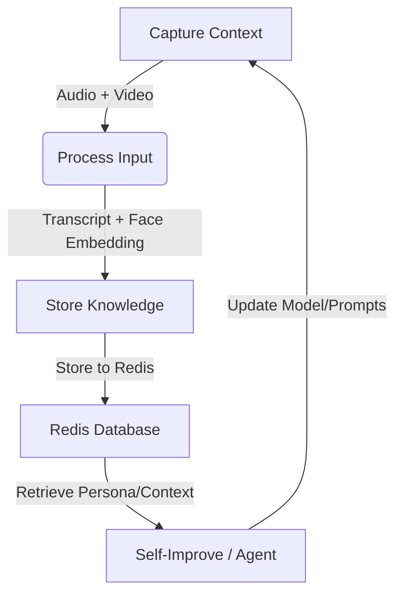

# Implementation Plan: Conversationalist Loop

This plan outlines the steps to implement the "Capture -> Store -> Train" loop for the Conversationalist agent, integrating the OMI Glasses context capture with the Redis-based memory system.

## 1. Environment Setup
The new repository `conversationalist` requires a robust Python environment to handle Audio, Vision, and Redis operations.

### Dependencies
- **Audio/VAD**: `pyaudio`, `silero-vad`, `numpy`
- **Transcription**: `faster-whisper`, `torch` (CUDA recommended)
- **Vision/Face**: `insightface`, `onnxruntime-gpu` (for face embeddings)
- **Storage**: `redis`
- **LLM**: `anthropic` (for extraction)

### Setup Script (`setup_env.ps1`)
We will create a script to:
1. Create a `venv`.
2. Install PyTorch with CUDA support.
3. Install all project requirements.

## 2. The Loop Architecture

The system follows a continuous loop:



### Component 1: Capture Context (`capture_service/`)
**Current Status**: `pipecat_glasses_sync.py` captures audio via laptop mic (Sileo VAD) and syncs it with OMI Glasses video feed.
**Missing Piece**: Face Embedding Generation.
**Action**:
- Update `pipecat_glasses_sync.py` to import `insightface`.
- When a video frame is captured during speech, run Face Detection + Embedding.
- Output: `Transcript`, `Face Embedding`, `Timestamp`.

### Component 2: Store Knowledge (`person_store.py`)
**Current Status**: Exists. Handles Redis connection, profile creation, and conversation storage.
**Integration**:
- Create a bridge script (`bridge.py` or modify `pipecat_glasses_sync.py`) to import `person_store`.
- When a transcript is finalized in `pipecat_glasses_sync.py`:
    1. Call `person_store.process_encounter(face_embedding, transcript)`.
    2. Receive back the `recall_summary`.
    3. Display this summary in the UI (e.g., "Oh, that's Sarah from Stripe!").

### Component 3: Self-Improve (Train/Q-LoRA)
**Concept**: The agent should "learn" from these interactions better than just RAG.
**Action**:
- **Data Collection**: `person_store.py` already saves conversation history.
- **Training Pipeline**:
    1. Export recent conversations from Redis.
    2. Format into `(Instruction, Input, Output)` tuples for Q-LoRA.
    3. Fine-tune a small LLM (e.g., Llama-3-8B or similar) on this personal data to better "mimic" the user's memory or style.
    *Note: This is a heavy asynchronous task.*

## 3. Immediate Implementation Steps

1. **Verify `capture_service`**: Ensure the migrated scripts run in the new repo.
2. **Add Face Recognition**: Install `insightface` and integrate it into the capture loop.
3. **Connect to Redis**: Update `pipecat_glasses_sync.py` to use `person_store.process_encounter`.
4. **UI Update**: Show the "Recall Summary" in the HTML frontend overlay.

## 4. Directory Structure
```
conversationalist/
├── capture_service/           # [MIGRATED] Audio/Visual capture logic
│   ├── pipecat_glasses_sync.py
│   ├── whisper_service.py
│   └── ...
├── person_store.py            # [EXISTING] Redis memory logic
├── examples/                  # Reference scripts
├── setup_env.ps1             # [NEW] Installation helper
└── requirements.txt           # Updated dependencies
```
